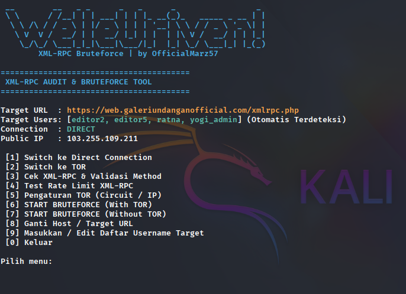
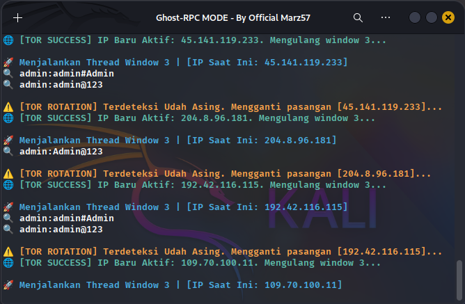

# WordPress XML-RPC Audit & Bruteforce Tool

<table width="100%">
  <tr>
    <td width="51%" align="center">
      <font face="Arial, Helvetica, sans-serif" size="0.8rem"><b>📷 Preview 1: Dasbor Menu & Otomatis Scan User</b></font><br>
      
    </td>
    <td width="50%" align="center">
      <font face="Arial, Helvetica, sans-serif" size="0.8rem"><b>📷 Preview 2: Proses Bruteforce & Rotasi IP Otomatis</b></font><br>
      
    </td>
  </tr>
</table>

<br>

Skrip pentesting modular untuk mengaudit celah keamanan pada endpoint `xmlrpc.php` WordPress. Alat ini dirancang untuk melakukan pengujian _rate limit_, validasi ketersediaan _method_ inti, deteksi username otomatis, serta simulasi serangan _bruteforce_ (_single_ atau _multicall_ batch) dengan fitur rotasi IP otomatis menggunakan jaringan **TOR** demi menjaga privasi dan menghindari pemblokiran IP firewall/WAF.

---

## 🔥 Fitur Utama

- **Otomatis Scan Username dan Cek XML-RPC:** Menembak REST API WordPress target (`/wp-json/wp/v2/users`) saat program pertama kali dibuka untuk mengenali user dan XML-RPC yg valid.
- **Transparansi Rotasi IP TOR:** Menampilkan log perubahan alamat IP secara _real-time_ (`IP Lama ➡️ IP Baru`) ketika sudah ter-blokir/kena rate limit _otomatis_.
- **Dua Mode Bruteforce:** Mendukung metode konvensional (_Single_) multi-threading dan metode efisien _Multicall_ (5 pasang password dalam 1 paket request XML).
- **Manajemen Host & User Fleksibel:** Opsi ganti target URL atau modifikasi daftar username langsung dari dalam dasbor menu navigasi tanpa mematikan skrip.
- **Pencatatan Otomatis:** Kombinasi kredensial yang berhasil tembus langsung dicatat secara otomatis ke dalam berkas `success.txt`.

---

## 🛠️ Persyaratan Sistem & Instalasi

### 1. Clone Repositori

```bash
git clone https://github.com/Marz57/xmlrpc-torbrut
cd xmlrpc-torbrut
```

### 2. Setup Virtual Environment & Install Dependensi Python

Jalankan perintah berikut untuk mengisolasi library agar tidak bentrok dengan sistem utama:

```bash
# Membuat Virtual Environment
python -m venv venv

# Mengaktifkan Virtual Environment (Linux / Termux)
source venv/bin/activate

# Menginstal seluruh library pendukung (requests, stem, termcolor)
pip install -r requirements.txt
```

---

## 🌐 Konfigurasi Detail Layanan TOR (Penting!)

Agar fitur rotasi IP otomatis dapat bekerja, skrip membutuhkan layanan TOR lokal yang berjalan di latar belakang sebagai _Proxy_ dan _Control Port_ yang terbuka.

### Langkah Setup pada Linux (Kali Linux / Ubuntu / Debian)

1. **Instal TOR Service:**

   ```bash
   sudo apt update && sudo apt install tor -y
   ```

2. **Konfigurasi File `torrc`:**
   Buka file konfigurasi utama TOR menggunakan text editor (seperti nano):

   ```bash
   sudo nano /etc/tor/torrc
   ```

   Cari baris berikut, hilangkan tanda pagar (`#`) jika dinonaktifkan, atau tambahkan konfigurasi ini di bagian paling bawah file:

   ```text
   SocksPort 9050       # Port Proxy lalu lintas jaringan skrip
   ControlPort 9051     # Port Kontrol perintah pergantian IP (NEWNYM)
   CookieAuthentication 0
   ```

   _Catatan: Pastikan `CookieAuthentication` diubah menjadi `0` agar skrip bisa langsung mengirim perintah Control Port tanpa hambatan izin._

3. **Restart & Cek Status TOR:**
   Pastikan layanan TOR dijalankan ulang agar konfigurasi baru aktif:
   ```bash
   sudo systemctl restart tor
   sudo systemctl status tor
   ```

### Langkah Setup pada Android (Termux)

1. Instal paket melalui repositori Termux: `pkg install tor`
2. Jalankan perintah editor: `nano $PREFIX/etc/tor/torrc`
3. Masukkan konfigurasi yang sama: `SocksPort 9050` dan `ControlPort 9051`.
4. Jalankan TOR di sesi terminal baru dengan mengetik: `tor`

---

## 🚀 Cara Penggunaan Skrip

Jalankan skrip utama dengan menyertakan parameter argumen target URL `-u` atau `--url`:

```bash
python3 torbrute.py -u http://target.com
```
atau
```bash
./torbrute.py -u http://target.com
```

### Alur Navigasi Menu:

1. **Menu 1 & 2:** Mengalihkan jalur lalu lintas koneksi (`DIRECT` internet biasa atau dialihkan lewat `TOR Proxy`).
2. **Menu 3 & 4:** Untuk memastikan bahwa XML-RPC aktif/tidak terhadap _GET_ atau _POST_ sebelum bruteforce, dan melakukan pengecekan respon server dan melakukan _stress test_ batasan request (Rate Limiting).
3. **Menu 6 & 7:** Memulai serangan _bruteforce_. Kamu akan ditanya jenis penyerangan (_multicall_ atau _single_ otomatis rotasi setiap IP di Block/Rate Limit jika sedang memakai mode TOR).
4. **Menu 8:** Digunakan untuk mengganti host/target langsung tanpa keluar/run script lagi.

---

## ⚠️ Disclaimer (Penolakan Tanggung Jawab)

Penggunaan alat ini **hanya diizinkan** untuk keperluan pembelajaran, riset keamanan cyber, serta pengujian penetrasi legal (Authorized Penetration Testing) pada sistem milik sendiri atau sistem yang telah memberikan izin tertulis secara sah. Segala bentuk penyalahgunaan pada sistem pihak ketiga tanpa izin di luar tanggung jawab pengembang skrip ini.
